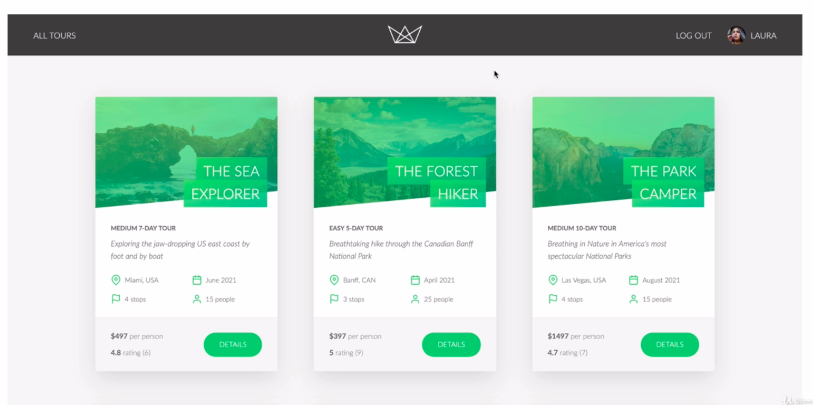
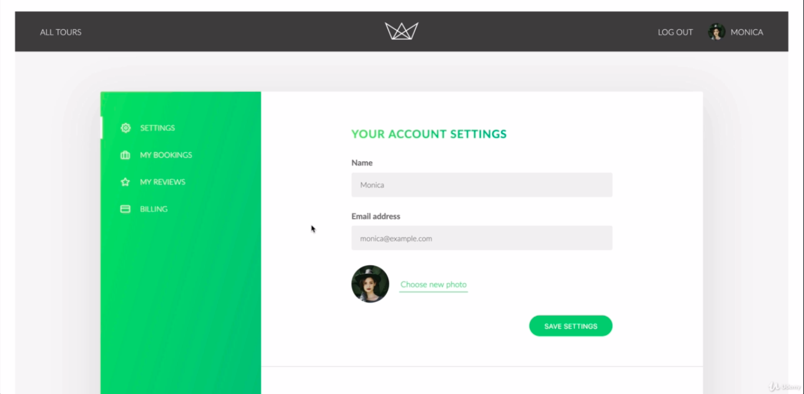
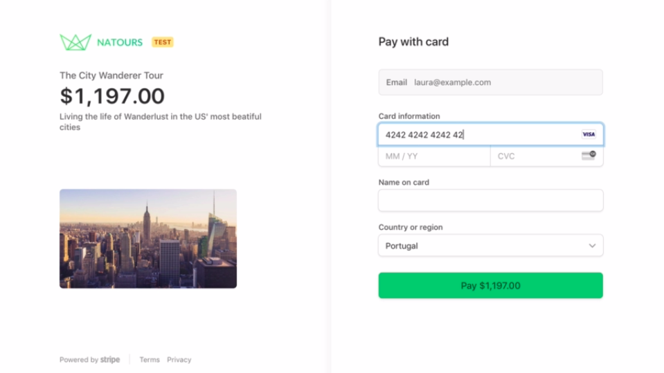
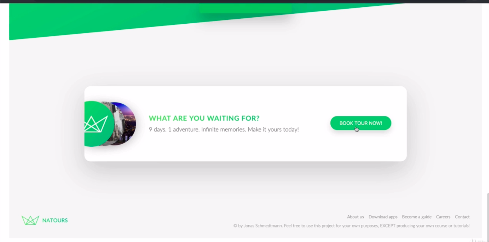
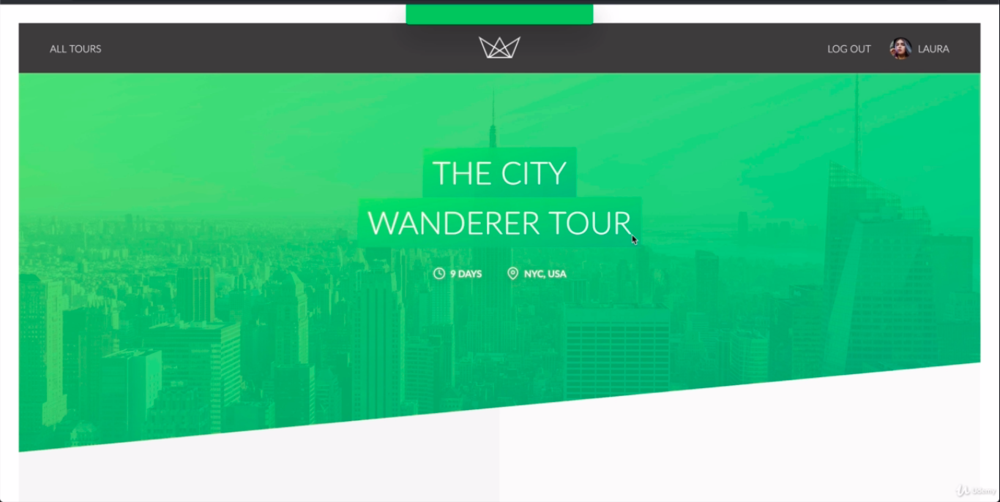
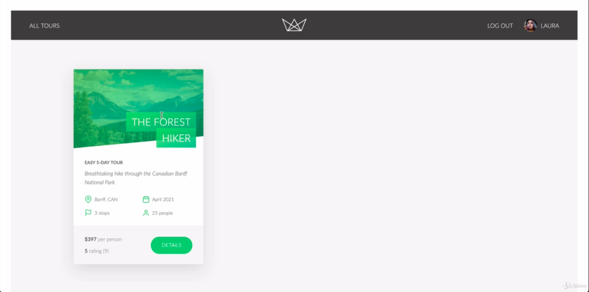

<h1> Natours </h1>
<h2>A Tour web-application with server-side rendering </h2>
 <h3> In this application we can see tours available and details of tour and book a tour by doing payment  The accountholders even can review the website</h3>
<h3>It is completely integrated with payments and sending Emails to accounts</h3> 
<h3>I made this project with Node js, Express and Mongodb while learning from Jonus course from udemy </h3>
  
<h2> Here is glimpse of application </h2>
 <h3> The Home Page </h3>
 
 <h3> Profile page </h3>
 
 <h3> Payments page </h3>
 
 <h3> Bookings page </h3>
 
 <h3> Details about particular Tour</h3>
 
 <h3> Booked page </h3>
 

